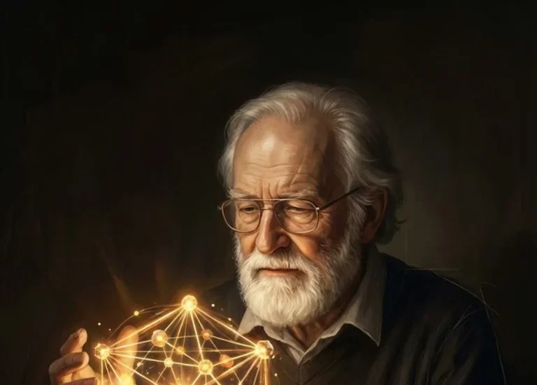

# Programming as Theory Building: A Summary

[Peter Naur](https://en.wikipedia.org/wiki/Peter_Naur) (1928–2016) was a Danish computer scientist, Turing Award recipient, and co-creator of Backus-Naur Form (BNF). In 1985, he published "Programming as Theory Building," a short but influential paper that reframes what programming fundamentally *is*.

---

## The Core Thesis

Programming is not primarily the production of code and documentation. It is the building of a **theory**—a mental model in the programmer's mind about how real-world affairs map onto the program.

The program text and documentation are secondary artifacts. The theory is primary.

---

## What "Theory" Means

Naur draws on philosopher [Gilbert Ryle](https://en.wikipedia.org/wiki/Gilbert_Ryle)'s concept of theory: knowledge that enables you not only to *do* things but also to *explain*, *justify*, and *answer questions* about what you're doing.

A programmer who possesses the theory of a program can:

1. **Explain** how the solution relates to the real-world problem it addresses
2. **Justify** why each part of the program is structured the way it is
3. **Respond constructively** to requests for modification

The third capacity is decisive. Anyone can read code and understand *what* it does. Only someone with the theory knows *how to change it correctly* when requirements shift.

---

## Why Documentation Fails

Naur's central claim is that theory **cannot, in principle, be fully expressed** in documentation. This isn't about lack of time or effort—it's an epistemological limit.

Theory depends on recognizing *similarities* between real-world situations: which aspects matter, which don't, how new requirements resemble existing ones. These similarities resist formalization:

> "The similarities in question are not, and cannot be, expressed in terms of criteria, no more than the similarities of many other kinds of objects, such as human faces, tunes, or tastes of wine, can be thus expressed."

You can't write rules for recognizing faces. You can't write rules for recognizing when a new feature fits naturally into an existing architecture. Both require tacit knowledge built through experience.

---

## Program Life, Death, and Revival

Naur extends the theory-building view to a program's lifecycle:

- A program **lives** while programmers who possess its theory continue to maintain it
- A program **dies** when that team dissolves—even if the code still runs
- **Revival** (reconstructing the theory from documentation alone) is extremely costly and often produces a *different* theory than the original

This explains why programs decay under maintenance by programmers who lack the original theory. They add "patches" that work functionally but violate the design's coherence. Over time, the structure becomes "entirely ineffective by amorphous additions of many different kinds."

---

## Implications

If Naur is right:

- **Programmers are not replaceable components.** They carry irreplaceable knowledge.
- **Documentation cannot substitute for human continuity.** Passing along theory requires working closely with those who have it.
- **Program modification is fundamentally different from program production.** It requires theory, not just text manipulation.
- **No methodology guarantees good programs.** Theory-building is personal, contextual, and resists proceduralization.

---

## Where to Read More

The original paper was published in *Microprocessing and Microprogramming* (1985) and reprinted in Naur's collection *Computing: A Human Activity* (1992). It also appears as an appendix in [Alistair Cockburn](https://en.wikipedia.org/wiki/Alistair_Cockburn)'s *Agile Software Development: The Cooperative Game* (2nd ed., 2006), with valuable commentary.

---

[← Back to Index](index.md)
