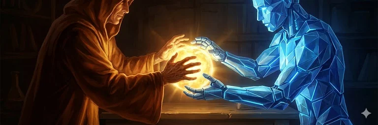
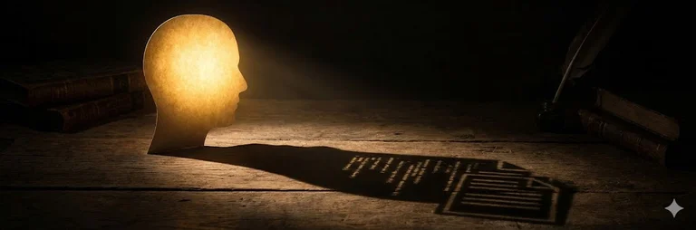
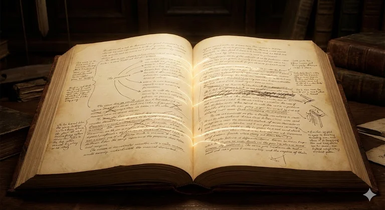

🇺🇸 [Read in English](../en/001-naur-documentation-pessimism.md)
 
📃 [Leer en capítulos](index.md)

# Sobre el Pesimismo Documental de Naur

>  En 1985, Peter Naur argumentó que programar es construir teoría, y que la teoría no puede capturarse completamente en documentación. **Pero su pesimismo es más acotado de lo que se supone.** Se aplica a la documentación técnica de artefactos, no a la documentación como empresa humana. La IA no "resuelve" el problema, pero crea condiciones donde la transmisión de teoría se vuelve más probable.

---

En 1985, el científico de la computación [Peter Naur](https://es.wikipedia.org/wiki/Peter_Naur) publicó "Programming as Theory Building"—un ensayo breve e influyente que argumenta que programar es fundamentalmente construir modelos mentales, no producir código. La *teoría* del programador sobre cómo los problemas del mundo real se mapean al software es el producto esencial; el código y la documentación son artefactos secundarios. Crucialmente, Naur afirmó que esta teoría **no puede capturarse completamente en documentación**, porque involucra conocimiento tácito que resiste la formalización. (Ver [nuestro resumen](naur-paper-es.md) o el [ensayo original](https://ingenieria-de-software-i.github.io/assets/bibliografia/la-programacion-como-construccion-de-teoria.pdf) en versión española.)

Pero el pesimismo de Naur apunta a la documentación *técnica*—especificaciones, código, documentos de diseño—no a toda comunicación escrita. El Renacimiento demuestra que los documentos *pueden* transmitir teoría cuando están escritos para hacerlo.

La colaboración con IA no resuelve el problema de documentación reduciendo el esfuerzo (eso malinterpreta el argumento epistemológico de Naur). Pero sí crea condiciones novedosas: articulación forzada, diálogo preservado, iteración con menor fricción. Estas hacen más probable la transmisión de teoría, aunque nunca sea completa.

---

## Capítulos

0. [Prefacio](#prefacio) — Quién escribió esto y por qué importa la advertencia sobre el argumento falaz
1. [El Argumento Real de Naur](#i-el-argumento-real-de-naur) — Epistemológico, no económico
2. [El Argumento Falaz a Evitar](#ii-el-argumento-falaz-a-evitar) — Lo que la IA no resuelve
3. [El Alcance del Pesimismo](#iii-el-alcance-del-pesimismo-de-naur) — Solo documentación de artefactos
4. [Evidencia de la Transmisión Cultural](#iv-evidencia-de-la-transmisión-cultural) — El argumento del Renacimiento
5. [Por Qué Falla la Documentación Técnica](#v-por-qué-falla-la-documentación-técnica) — El análisis de Cockburn
6. [Articulación Forzada](#vi-articulación-forzada) — La IA como interlocutor
7. [Preservación del Diálogo](#vii-preservación-del-diálogo) — Capturando el proceso de resolución
8. [Lo Que Permanece Sin Resolver](#viii-lo-que-permanece-sin-resolver) — El conocimiento tácito persiste
9. [Hacia una Documentación Resiliente](#ix-hacia-una-documentación-resiliente-a-la-teoría) — Recomendaciones prácticas
10. [Conclusión](#conclusión) — Síntesis

---

## Referencias

- [Alexander, C.](https://es.wikipedia.org/wiki/Christopher_Alexander) (1977). *A Pattern Language*. Oxford University Press.
- [Alexander, C.](https://es.wikipedia.org/wiki/Christopher_Alexander) (1979). *The Timeless Way of Building*. Oxford University Press.
- [Cockburn, A.](https://en.wikipedia.org/wiki/Alistair_Cockburn) (2006). *Agile Software Development* (2da ed.). Addison-Wesley.
- [Kernighan, B. W.](https://es.wikipedia.org/wiki/Brian_Kernighan), & [Plauger, P. J.](https://en.wikipedia.org/wiki/P._J._Plauger) (1976). *Software Tools*. Addison-Wesley.
- [Kuhn, T. S.](https://es.wikipedia.org/wiki/Thomas_Kuhn) (1970). *The Structure of Scientific Revolutions* (2da ed.). University of Chicago Press.
- [Naur, P.](https://es.wikipedia.org/wiki/Peter_Naur) (1985). Programming as Theory Building. *Microprocessing and Microprogramming*, 15.
- [Polanyi, M.](https://es.wikipedia.org/wiki/Michael_Polanyi) (1973). *Personal Knowledge*. Routledge & Kegan Paul.
- [Ryle, G.](https://es.wikipedia.org/wiki/Gilbert_Ryle) (1949). *The Concept of Mind*. Hutchinson.

---

# Prefacio

**Autor**: Ricardo Rocha
**Fecha**: 2025-12-24
**Estado**: Documento de trabajo

---

Este artículo articula una comprensión refinada del ensayo de Peter Naur "La programación como construcción de teoría" (1985), argumentando que su famoso pesimismo sobre la documentación es más acotado de lo que comúnmente se supone—y que la colaboración humano-IA crea condiciones para la transmisión de teoría que Naur no podría haber anticipado.

## La Advertencia del Argumento Falaz

Antes de continuar, un acto de honestidad intelectual.

La tesis original de este artículo era: *La colaboración con IA hace posible la preservación de teoría porque reduce los costos laborales que hacían impráctica la documentación exhaustiva.*

Esto es incorrecto. Malinterpreta el argumento de Naur. Su pesimismo es **epistemológico**, no económico. Él afirma que cierto conocimiento *no puede en principio* ser articulado—no que nos falte tiempo para articularlo.

Incluimos esta advertencia explícitamente porque otros llegarán con la misma intuición. El argumento falaz es atractivo. Rechazarlo clarifica qué es lo que la colaboración con IA realmente cambia—y qué no.

---

# I. El Argumento Real de Naur

El ensayo de Peter Naur "La programación como construcción de teoría" (1985) propone que la programación debe entenderse no como la producción de textos de programa sino como la construcción de *teoría* en las mentes de los programadores.

---

## Las Tres Capacidades

Esta teoría, basándose en la epistemología de [Gilbert Ryle](https://es.wikipedia.org/wiki/Gilbert_Ryle) (1949), abarca:

1. **Capacidad explicativa** — El programador puede explicar cómo la solución se relaciona con el mundo que aborda
2. **Capacidad justificativa** — El programador puede explicar *por qué* cada parte es como es
3. **Capacidad modificatoria** — El programador puede responder constructivamente a demandas de cambio

La tercera capacidad es crucial. Cualquiera puede leer código y entender *qué* hace. Solo alguien con la teoría puede saber *cómo cambiarlo correctamente* cuando las circunstancias cambian.

---

## La Afirmación Central

La afirmación central de Naur es que la teoría "no podría concebiblemente expresarse" en documentación porque involucra conocimiento tácito que desafía la formalización:

> "La dependencia de una teoría en la comprensión de ciertos tipos de similitud entre situaciones y eventos del mundo real da la razón por la cual el conocimiento que posee alguien que tiene la teoría no podría, en principio, expresarse en términos de reglas. De hecho, las similitudes en cuestión no son, y no pueden ser, expresadas en términos de criterios, como tampoco pueden serlo las similitudes de muchos otros tipos de objetos, como rostros humanos, melodías o sabores de vino."

Esta es una afirmación **epistemológica**, no económica. Naur no está diciendo "nos falta tiempo para documentar apropiadamente". Está diciendo que la teoría involucra el reconocimiento de similitudes que están, en principio, más allá de la formulación explícita.

La distinción importa. Si el problema fuera el tiempo, más esfuerzo lo resolvería. Si el problema es epistemológico, ninguna cantidad de esfuerzo ayuda.

---

# II. El Argumento Falaz a Evitar

Antes de continuar, debemos rechazar explícitamente un argumento atractivo pero erróneo.

---

## El Argumento Falaz

> El pesimismo de Naur sobre la documentación era válido para su época porque mantener la teoría y el código sincronizados mediante documentación era una empresa descomunal que solo los humanos podían realizar. Los humanos carecen del tiempo, energía y capacidad cognitiva para mantener tal documentación efectivamente. La colaboración con IA cambia esta ecuación al reducir los costos laborales, haciendo posible la preservación de teoría de maneras que Naur no podría haber previsto.

Este argumento malinterpreta a Naur. Su pesimismo no está arraigado en los costos laborales sino en la *naturaleza del conocimiento tácito*. Si el problema fuera meramente que la documentación es laboriosa, entonces más esfuerzo (o asistencia de IA) lo resolvería. Pero la afirmación de Naur es más fuerte: cierto conocimiento *no puede en principio* ser articulado, sin importar cuánto tiempo o asistencia se tenga.

---

## Los Testigos de la Imposibilidad

[Michael Polanyi](https://es.wikipedia.org/wiki/Michael_Polanyi), a quien Naur cita, lo hace vívido:

> "Es patético observar los esfuerzos interminables—equipados con microscopía y química, con matemáticas y electrónica—para reproducir un solo violín del tipo que el semi-analfabeto Stradivarius producía rutinariamente hace más de 200 años."

Ninguna cantidad de esfuerzo documental podría capturar lo que Stradivarius sabía tácitamente.

[Christopher Alexander](https://es.wikipedia.org/wiki/Christopher_Alexander) llegó a la misma conclusión en arquitectura. Su *Cualidad Sin Nombre*—la propiedad que hace que los espacios se sientan vivos en lugar de muertos—es inmediatamente reconocible pero indefinible. Alexander pasó años codificando patrones (*A Pattern Language*, 1977), produciendo 253 de ellos, pero reconoció que seguir los patrones no produce la cualidad. Como escribió:

> "Hay una cualidad central que es el criterio raíz de vida y espíritu en un hombre, un pueblo, un edificio o un territorio silvestre. Esta cualidad es objetiva y precisa, pero no puede ser nombrada."

---

## La Convergencia

Tres dominios—el oficio (Polanyi), la arquitectura (Alexander), la programación (Naur)—convergen en el mismo muro epistemológico. Esto no es coincidencia sino evidencia de una limitación estructural en los sistemas formales.

Naur probablemente respondería a las afirmaciones sobre la IA: "La IA es solo otro sistema formal; no puede capturar lo que los humanos mismos no pueden articular."

No debemos afirmar que la IA "finalmente resuelve" el problema de documentación. Eso sería malentender cuál es el problema.

---

# III. El Alcance del Pesimismo de Naur

Habiendo establecido qué argumenta realmente Naur, podemos observar que su pesimismo tiene un alcance específico.

---

## Lo Que Naur Critica

La documentación que Naur critica consiste en:

- Textos de programa
- Código anotado
- Especificaciones
- Documentos de diseño
- Documentación de usuario

Su Caso 1 es ilustrativo: el Grupo B recibió "documentación completa, incluyendo textos de programa anotados y mucha discusión escrita adicional sobre el diseño" del Grupo A, pero repetidamente propuso modificaciones que "no hacían uso de las facilidades que no solo eran inherentes a la estructura del compilador existente sino que estaban discutidas extensamente en su documentación".

La documentación *describía* las facilidades. El Grupo B *leyó* la documentación. Sin embargo, carecían de la teoría—la comprensión de *cuándo* y *por qué* aplicar esas facilidades.

---

## Lo Que Naur No Afirma

Nótese lo que Naur *no* afirma: no afirma que toda comunicación escrita falla en transmitir teoría.

De hecho, su propio artículo transmite exitosamente su teoría a los lectores. *El Concepto de Mente* de [Ryle](https://es.wikipedia.org/wiki/Gilbert_Ryle) transmitió su epistemología. *La Estructura de las Revoluciones Científicas* de [Kuhn](https://es.wikipedia.org/wiki/Thomas_Kuhn) transmitió la teoría de paradigmas. Los escritos de [Polanyi](https://es.wikipedia.org/wiki/Michael_Polanyi) transmitieron el concepto mismo del conocimiento tácito.

---

## Una Distinción Crucial

Esto sugiere una distinción:

| Tipo de Documentación | Contenido Principal | Transmisión de Teoría |
|----------------------|---------------------|----------------------|
| **Técnica/Centrada en artefactos** | QUÉ existe, CÓMO funciona | Pobre—asume teoría compartida |
| **Centrada en teoría** | POR QUÉ se tomaron decisiones, CUÁNDO aplican los patrones | Mejor—busca construir teoría |

La documentación técnica falla en la transmisión de teoría no porque la documentación sea inherentemente limitada sino porque *presupone* la teoría que debería transmitir. Sirve como *recordatorio* para quienes ya poseen la teoría, no como *educación* para quienes no la tienen.

---

# IV. Evidencia de la Transmisión Cultural

Si la documentación en general no pudiera transmitir teoría, el progreso cultural humano a través de obras escritas sería inexplicable.

---

## El Renacimiento

El renacimiento del saber clásico en la Europa de los siglos XIV al XVI dependió de la transmisión de la teoría aristotélica y platónica a través de una brecha de mil años mediante textos preservados.

Eruditos que nunca habían conocido a un filósofo griego antiguo adquirieron suficiente de su teoría como para extenderla y debatirla. La teoría viajó a través de documentos—imperfectamente, requiriendo interpretación, pero suficientemente como para permitir su continuación.

---

## Las Matemáticas

Cada generación de matemáticos construye sobre demostraciones y conceptos transmitidos a través de obras escritas. Los *Elementos* de [Euclides](https://es.wikipedia.org/wiki/Euclides) transmitieron teoría geométrica durante más de dos milenios.

La teoría persiste incluso cuando ninguna persona viva la posee mediante transmisión directa. Un estudiante de hoy puede reconstruir el razonamiento euclidiano solo a partir del texto.

---

## Los Paradigmas Científicos

El mismo [Kuhn](https://es.wikipedia.org/wiki/Thomas_Kuhn) documentó cómo los paradigmas científicos se transmiten a través de libros de texto—artefactos escritos que de alguna manera transmiten no solo hechos sino *maneras de ver problemas*.

Un estudiante de física aprende no solo ecuaciones sino cómo reconocer cuándo aplica cada ecuación. Esto es transmisión de teoría a través de documentación.

---

## La Pregunta Refinada

Estos ejemplos prueban que la teoría *puede* ser documentada y transmitida. La pregunta es por qué la documentación de software típicamente falla donde la escritura filosófica, matemática y científica a veces tiene éxito.

La respuesta yace en lo que contienen estos documentos exitosos: no solo QUÉ y CÓMO, sino POR QUÉ y CUÁNDO. Buscan construir teoría en el lector, no meramente describir artefactos.

---

# V. Por Qué Falla la Documentación Técnica

[Alistair Cockburn](https://en.wikipedia.org/wiki/Alistair_Cockburn), comentando sobre Naur, sugiere que la documentación técnica falla porque apunta al objetivo equivocado.

---

## El Objetivo Equivocado

> "Usando las ideas de Naur, el trabajo del diseñador no es transmitir 'el diseño' sino transmitir 'las teorías' que impulsan el diseño. El segundo objetivo es más útil y más apropiado."

La documentación técnica describe artefactos. Pero los artefactos son *productos* de la teoría, no la teoría misma. Leer un texto de programa te dice qué decisiones se tomaron; no te dice:

- Qué consideraciones llevaron a esas decisiones
- Qué alternativas fueron rechazadas y por qué
- Qué similitudes percibió el programador entre este problema y otros

La metáfora del iceberg aplica: la documentación muestra la punta (el artefacto); la teoría es la masa sumergida que lo sostiene.

---

## Un Objetivo Reformulado

Cockburn además observa:

> "La documentación no puede—y por tanto no necesita—decirlo todo. Su propósito es ayudar al siguiente programador a construir una teoría precisa sobre el sistema."

Esto reformula el objetivo. La documentación no necesita (y no puede) *contener* teoría explícitamente. Debe proporcionar material suficiente para que un lector *reconstruya* la teoría—para construir su propia comprensión que, aunque no sea idéntica a la del programador original, sea lo suficientemente cercana como para guiar modificaciones correctas.

---

## Lo Que Documentan los Diseñadores Experimentados

Los diseñadores experimentados, observa Cockburn, frecuentemente comienzan la documentación con:

- Las metáforas
- Texto describiendo el propósito de cada componente principal
- Dibujos de las interacciones principales entre componentes

Estos son dispositivos de transmisión de teoría, no descripciones de artefactos. Ayudan al lector a construir modelos mentales, no solo a registrar hechos.

---

# VI. Articulación Forzada

Habiendo rechazado el argumento falaz (la IA reduce costos laborales, por tanto resuelve la documentación), podemos preguntar qué *realmente* cambia la colaboración con IA sobre el desafío de Naur.

---

## El Efecto Interlocutor

Cuando un programador trabaja solo, mucho razonamiento permanece implícito. El programador sabe por qué se tomó una decisión pero nunca la articula porque no hay interlocutor.

La colaboración con IA introduce un interlocutor persistente. Para dirigir efectivamente a un asistente de IA, el programador debe articular:

- Intenciones
- Restricciones
- Justificaciones
- Criterios de éxito

Esta articulación queda capturada—en transcripciones, en instrucciones, en registros de sesión—y se convierte en material para la reconstrucción de teoría.

---

## Desplazando el Límite

Esto no resuelve el problema del conocimiento tácito. Cierto conocimiento permanece más allá de la articulación—el problema de Stradivarius persiste.

Pero desplaza el límite, haciendo explícito lo que de otro modo habría permanecido implícito. El interlocutor fuerza los pensamientos a convertirse en palabras. Esas palabras, una vez pronunciadas, pueden preservarse.

La diferencia no es que la IA extraiga conocimiento tácito (no puede). La diferencia es que explicarle a la IA hace que el conocimiento *articulable* sea efectivamente *articulado*.

---

## La Asimetría

Hay una asimetría aquí que importa: el humano retiene teoría entre sesiones; la IA olvida. Esto crea presión para documentar no para beneficio de la IA sino para el yo futuro del humano—y para sus sucesores.

La IA no es el repositorio de la teoría. Es la ocasión para articular la teoría.

---

# VII. Preservación del Diálogo

La documentación tradicional captura *conclusiones*: "El sistema usa el patrón X."

Raramente captura el *diálogo* que llevó a esa conclusión: "Consideramos los patrones X, Y y Z. Y fue rechazado porque... Z fue rechazado porque... X fue elegido porque..."

---

## El Razonamiento Hecho Visible

Las sesiones de colaboración humano-IA, cuando se preservan, capturan este diálogo. El proceso de razonamiento—incluyendo los comienzos en falso, las correcciones y los refinamientos—queda disponible para futuros lectores.

Esto es más cercano a cómo se transmite la teoría en el aprendizaje: no a través de manuales sino a través de la observación de la resolución de problemas. El aprendiz observa al maestro pensar, no solo actuar.

---

## Linaje Histórico

Esta intuición tiene linaje. Casi una década antes de Naur, [Kernighan](https://es.wikipedia.org/wiki/Brian_Kernighan) y [Plauger](https://en.wikipedia.org/wiki/P._J._Plauger) reconocieron que el aprendizaje ocurre a través de ejemplos concretos, no de principios abstractos:

> "La buena programación no se aprende de generalidades, sino viendo cómo programas significativos pueden hacerse limpios, fáciles de leer, fáciles de mantener y modificar, diseñados para humanos, eficientes y confiables, mediante la aplicación del sentido común y buenas prácticas de programación. El estudio cuidadoso e imitación de buenos programas conduce a mejor escritura."

---

## Lo Que K&P No Pudieron Preservar

Kernighan y Plauger solo pudieron preservar el *artefacto terminado*—el buen programa para ser estudiado e imitado.

El razonamiento que lo hizo bueno, las alternativas consideradas y rechazadas, los comienzos en falso corregidos—todo esto se perdió. El lector ve el destino pero no el viaje.

La colaboración con IA nos permite preservar no solo el programa sino el *proceso mismo de resolución de problemas*, cumpliendo más completamente lo que Kernighan y Plauger solo pudieron señalar.

---

# VIII. Lo Que Permanece Sin Resolver

La honestidad intelectual requiere reconocer lo que la colaboración con IA *no* cambia.

---

## El Conocimiento Tácito Permanece Tácito

Si un programador no puede articular por qué una solución "se siente correcta", la IA no puede extraer ese conocimiento. El problema de Stradivarius persiste. La Cualidad Sin Nombre permanece sin nombre.

La IA puede hacer preguntas que inciten la articulación. No puede alcanzar dentro de la mente y extraer lo que resiste las palabras.

---

## El Juicio No Puede Automatizarse

Saber cuándo aplicar un patrón, cuándo una excepción está justificada, cuándo una similitud aparente es engañosa—estas siguen siendo capacidades humanas que la IA puede apoyar pero no reemplazar.

La IA puede presentar candidatos: "Esto se parece al patrón X." Solo el humano puede juzgar si la similitud es profunda o superficial, si el patrón aplica o engaña.

---

## La Teoría Es Personal

Cada programador construye su propia teoría. Incluso con documentación perfecta, los nuevos programadores deben hacer el trabajo cognitivo de construcción de teoría.

La IA puede proporcionar más y mejor material para esta construcción pero no puede realizarla en nombre del programador. Leer no es comprender. Que te digan no es saber.

---

## El Lector Debe Encontrarse con el Escritor

La documentación centrada en teoría aún requiere un lector dispuesto y capaz de involucrarse profundamente.

Si los lectores tratan la documentación como material de referencia para consultar en lugar de como teoría para adquirir, ninguna cantidad de calidad documental ayudará. La transmisión requiere receptividad.

La mejor documentación sigue siendo solo material para la reconstrucción de teoría. La reconstrucción misma ocurre en las mentes, a través del esfuerzo, con el tiempo.

---

# IX. Hacia una Documentación Resiliente a la Teoría

Si tomamos a Naur en serio mientras reconocemos los cambios genuinos (aunque limitados) que la IA habilita, ¿qué prácticas se derivan?

---

## Documentar Teoría, No Solo Artefactos

Junto con (o en lugar de) especificaciones y referencias de API, mantener documentos que aborden:

- **Por qué** el sistema está estructurado como está
- **Qué alternativas** fueron consideradas y rechazadas
- **Cuándo** los patrones deben y no deben aplicarse
- **Cómo** el sistema se relaciona con el mundo que modela

Estas son las preguntas que un sucesor hará. Responderlas antes de que sean formuladas.

---

## Preservar el Diálogo

Tratar las transcripciones de colaboración con IA como artefactos documentales. Capturan el razonamiento en una forma más cercana a la observación del aprendizaje que a la documentación tradicional.

La transcripción muestra el proceso de resolución de problemas: los giros equivocados, las correcciones, el refinamiento gradual del entendimiento. Esto es material de transmisión de teoría.

---

## Abrazar la Redundancia

La teoría se transmite a través de múltiples canales—prosa, diagramas, ejemplos, conversación. La redundancia no es desperdicio; proporciona múltiples puntos de entrada para lectores con diferentes antecedentes y estilos de aprendizaje.

Si un camino está bloqueado (el lector no entiende el diagrama), otros permanecen (la prosa, los ejemplos). La resiliencia proviene de la multiplicidad.

---

## Probar la Transmisión de Teoría

La prueba definitiva de la documentación es si los nuevos miembros del equipo pueden adquirir suficiente teoría para hacer modificaciones correctas. Esto debe probarse explícitamente, no asumirse.

Preguntar: ¿puede alguien que solo tiene la documentación modificar este sistema correctamente? Si no, ¿qué falta?

---

## Aceptar la Imperfección

La documentación nunca capturará completamente la teoría. El objetivo no es la perfección sino la *suficiencia*—proporcionar suficiente material para que un lector motivado pueda construir una teoría funcional.

Alguna pérdida en la transmisión es inevitable. El objetivo es minimizarla, no eliminarla.

---

# Conclusión

El pesimismo de Naur sobre la documentación es válido pero más acotado de lo que frecuentemente se supone.

---

## Lo Que Naur Acertó

Se aplica específicamente a la documentación técnica que describe artefactos mientras presupone la teoría necesaria para entenderlos.

Tal documentación te dice QUÉ y CÓMO pero no POR QUÉ y CUÁNDO. Sirve a quienes ya tienen la teoría como recordatorio. Falla para quienes necesitan adquirir la teoría como educación.

---

## Lo Que Naur No Previó

La documentación centrada en teoría—el tipo que ha transmitido exitosamente entendimiento filosófico, matemático y científico a través de generaciones—no está sujeta a la misma crítica.

La colaboración humano-IA crea condiciones novedosas que hacen más probable la transmisión de teoría:

- **Articulación forzada** — El interlocutor hace explícito el conocimiento implícito
- **Diálogo preservado** — Se captura el razonamiento, no solo las conclusiones
- **Iteración con menor fricción** — La documentación puede evolucionar con el entendimiento

Estas no "resuelven" el problema de documentación. Mejoran las probabilidades.

---

## El Desafío Permanece

El desafío que Naur identificó permanece: la teoría se construye en las mentes, y la documentación es a lo sumo material para la reconstrucción de teoría, no la teoría misma.

Pero con prácticas apropiadas, podemos crear documentación que mejor apoye esta reconstrucción—documentación que sea resiliente a la teoría de maneras que Naur no podría haber anticipado, aunque no alcance el objetivo imposible de capturar la teoría completamente.

---

## La Luz a Través del Documento

El documento no es la teoría. Es un medio a través del cual la luz pasa—imperfectamente, con pérdida, pero suficientemente para iluminar del otro lado.

Nuestro objetivo no es atrapar luz en papel sino hacer el papel lo suficientemente traslúcido para que la luz pueda pasar a través.

---

*Este documento está vivo. Evoluciona con nuestra práctica.*

---

🏠 [Reflexiones de un desarrollador solitario](../../LEEME.md)
